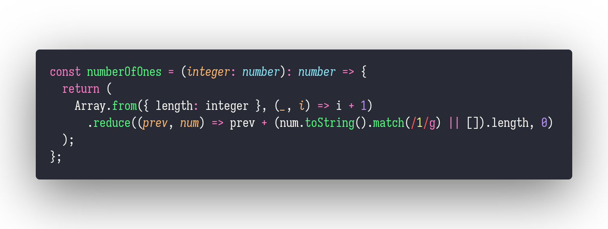

# numberOfOnes

Interview question of the [issue #259 of rendezvous with cassidoo](https://buttondown.email/cassidoo/archive/science-is-not-a-boys-game-its-not-a-girls-game/).

## The Question

Given an integer n, count the total number of 1 digits appearing in all non-negative integers
less than or equal to n.

### Example

```js
> numberOfOnes(14)
> 7 // 1, 10, 11, 12, 13, 14
```

## Solution


