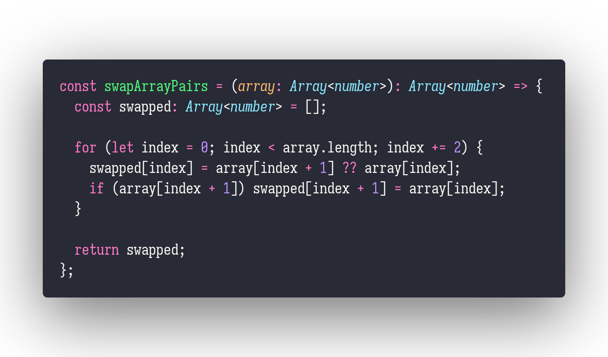

# swapPairs

Interview question of the [issue #260 of rendezvous with cassidoo](https://buttondown.email/cassidoo/archive/youve-got-to-get-up-every-morning-with-a-smile-on/).

## The Question

Given a list, swap every two adjacent nodes.
Something to think about: How would your code change if this were a linked list, versus an array?

### Example

```js
> swapPairs([1,2,3,4])
> [2,1,4,3]

> swapPairs([])
> []
```

## Solution


