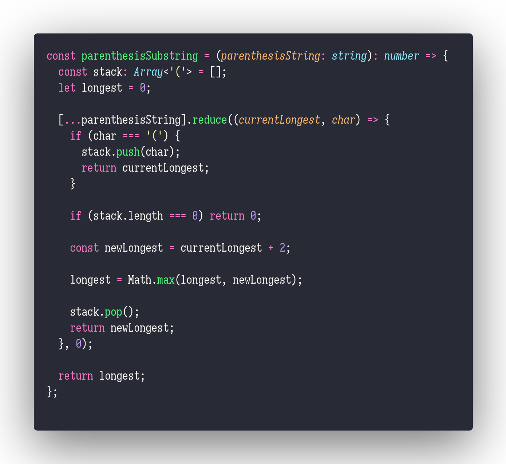

# parenthesisSubstring

Interview question of the [issue #261 of rendezvous with cassidoo](https://buttondown.email/cassidoo/archive/friends-and-good-manners-will-carry-you-where/).

## The Question

Given a string s consisting of various parenthesis ( and ), find the length of the longest valid
parenthesis substring.

### Example

```js
> parensSubstring('(()(')
> 2

> parensSubstring(')()(()))')
> 6
```

## Solution


