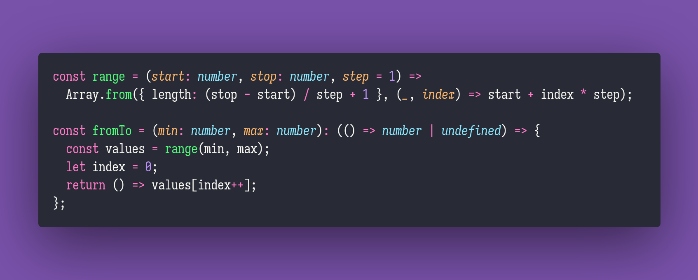

# From To

Interview question of the [issue #264 of rendezvous with cassidoo](https://buttondown.email/cassidoo/archive/if-everything-was-perfect-you-would-never-learn/).

## The Question

Write a function fromTo that produces a generator, that will produce values in a range.

### Example

```js
let gen = fromTo(5, 7) > gen();
5 > gen();
6 > gen();
7 > gen();
undefined;
```

## Solution


