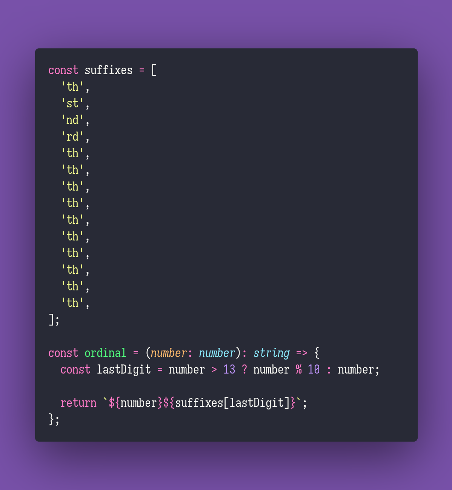

# Ordinal

Interview question of the [issue #267 of rendezvous with cassidoo](https://buttondown.email/cassidoo/archive/every-day-brings-new-choices-martha-beck/).

## The Question

Write a function to output the ordinal suffix of a positive integer concatenated to an inputted
number.

### Example

```js
> ordinal(3)
> '3rd'

> ordinal(57)
> '57th'
```

## Installing & Running

Just `pnpm install` to install all dependencies and then `pnpm test` to run the tests!

## Solution


