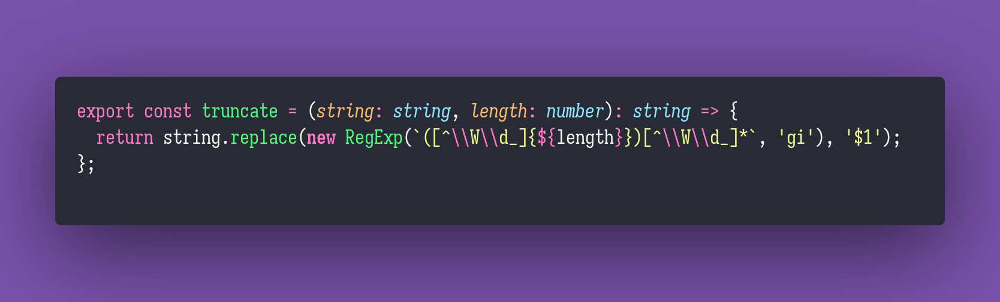

# Truncate

Interview question of the [issue #269 of rendezvous with cassidoo](https://buttondown.email/cassidoo/archive/instant-gratification-takes-too-long-carrie-fisher/).

## The Question

Write a function that truncates words in a string to length n.

### Example

```js
let n =
  3 >
  truncate("never gonna give you up", n) >
  "nev gon giv you up" >
  truncate("*hello* darkness, my ~old_friend", n) >
  "*hel* dar, my ~old_fri";
```

## Installing & Running

Just `pnpm install` to install all dependencies and then `pnpm test` to run the tests!

## Solution


