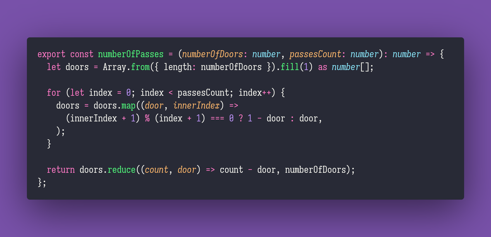

# Antidivisor

Interview question of the [issue #273 of rendezvous with cassidoo](https://buttondown.email/cassidoo/archive/i-dont-think-of-all-the-misery-but-of-the-beauty-4964/).

## The Question

Given a positive integer n, return all of its anti-divisors. Anti-divisors are numbers that do not divide a number by the largest possible margin (1 is not an anti-divisor of any number). [More information here!](https://oeis.org/A066272/a066272a.html)

### Example

```js
> antidivisor(1)
> []

> antidivisor(3)
> [2]

> antidivisor(5)
> [2,3]

> antidivisor(10)
> [3,4,7]

> antidivisor(234)
> [4,7,12,36,52,67,156]
```

## Solution


