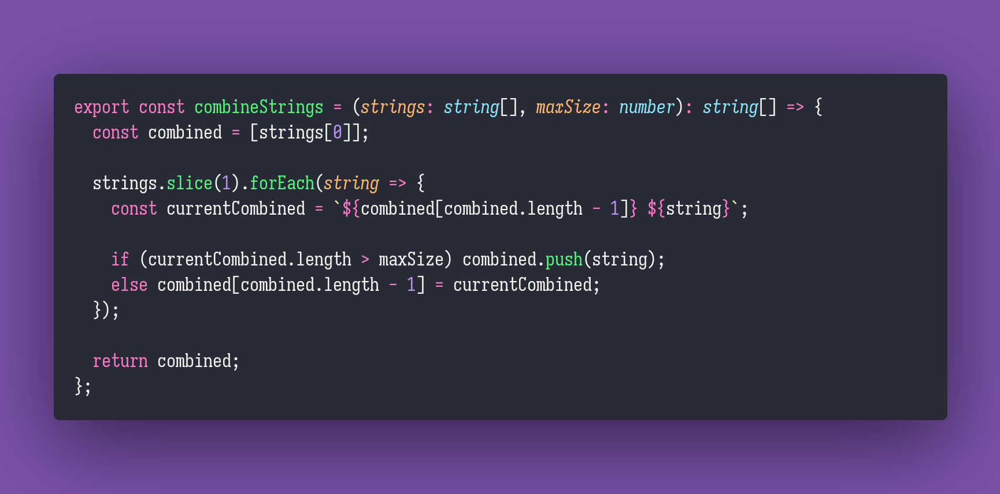

# combine-strings

Interview question of the [issue #274 of rendezvous with cassidoo](https://buttondown.email/cassidoo/archive/normal-is-nothing-more-than-a-cycle-on-a-washing/).

## The Question

Given a list of strings arr, and a max size n, return a new list where the strings (from left to
right) are joined together with a space, so that each new string is less than or equal to the max
size.

### Example

```js
> combineStrings(["a", "b", "c", "d", "e", "f", "g"], 5)
> ["a b c", "d e f", "g"]

> combineStrings(["a", "b", "c", "d", "e", "f", "g"], 12)
> ["a b c d e f", "g"]

> combineStrings(["alpha", "beta", "gamma", "delta", "epsilon"], 20)
> ["alpha beta gamma", "delta epsilon"]
```

## Installing & Running

Just `pnpm install` to install all dependencies and then `pnpm test` to run the tests!

## Solution


