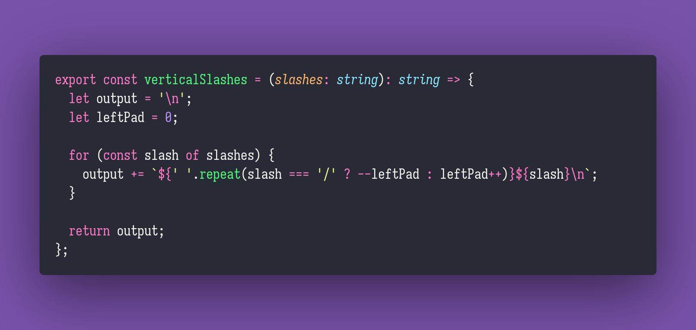

# Vertical Slashes

Interview question of the [issue #275 of rendezvous with cassidoo](https://buttondown.email/cassidoo/archive/normal-is-not-something-to-aspire-to-its-4437/).

## The Question

Write a function that takes a string of slashes (\ and /) and returns all of those slashes drawn
downwards in a line connecting them.

### Example

```js
> verticalSlashes('\\\//\/\\')
\
 \
  \
  /
 /
 \
 /
 \
  \
> verticalSlashes('\\\\')
\
 \
  \
   \
```

## Solution


