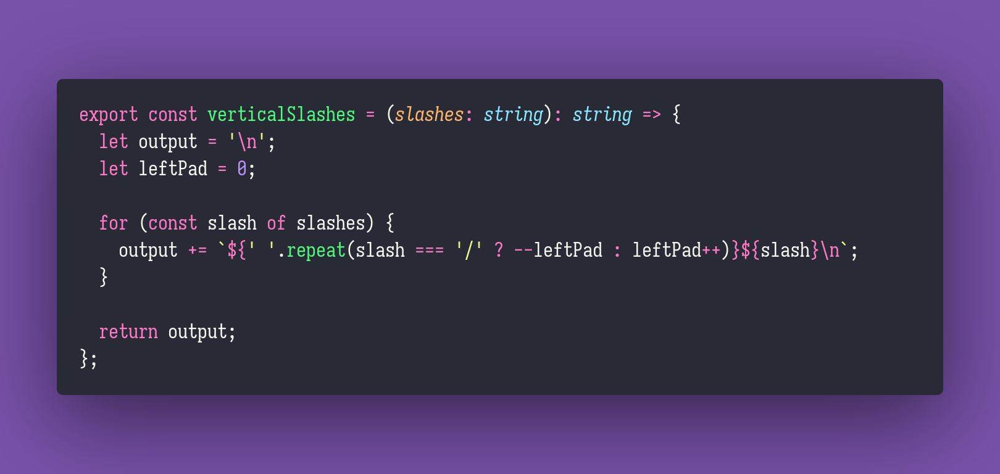

# Rectangle Sum

Interview question of the [issue #278 of rendezvous with cassidoo](https://buttondown.email/cassidoo/archive/life-has-no-blessing-like-a-prudent-friend/).

## The Question

Given a 2D array n of integers, and an array m of four (4) coordinates that represent corners of a
rectangle in n, return the sum of all of the numbers in the rectangle.

### Example

```js
n = [6, 9, -7, 3, 8, -1, -6, -4, 2, -7, 7, -7, -1, 4, 7, 9];

m = [-1, 8, -7, 2] > rectangleSum(n, m) > 2 > rectangleSum(n, [6, 3, 2, -7]) > 3;
```

## Installing & Running

Just `pnpm install` to install all dependencies and then `pnpm test` to run the tests!

## Solution


