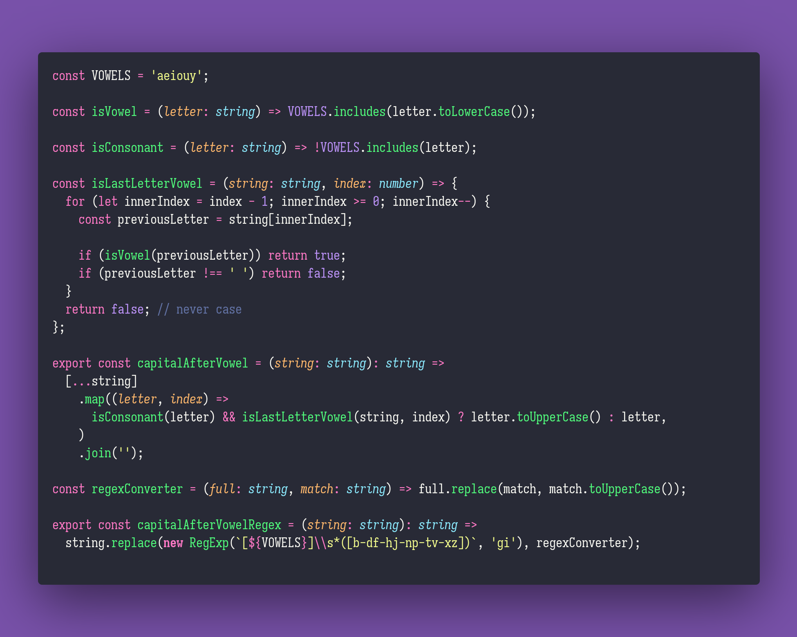

# Capital After Vowel

Interview question of the [issue #279 of rendezvous with cassidoo](https://buttondown.email/cassidoo/archive/dont-be-afraid-of-hard-work-nothing-worthwhile/).

## The Question

Given a string, make every consonant after a vowel uppercase. Can you do this with and without
regex?

### Example

```js
> capitalAfterVowel("hello world")
> "heLlo WoRld"

> capitalAfterVowel("xaabeuekadii")
> "xaaBeueKaDii"
```

## Solution



Also a full regex solution at: <https://regex101.com/r/SlL9lq/1>
