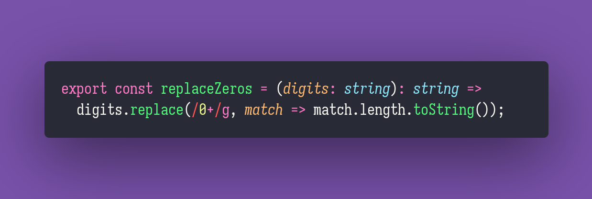

# Replace Zeros

Interview question of the [issue #280 of rendezvous with cassidoo](https://buttondown.email/cassidoo/archive/love-is-all-we-have-the-only-way-that-each-can/).

## The Question

Given a string of any length which contains only digits from 0 to 9, replace each consecutive run of the
digit 0 with its length.

### Example

```js
> replaceZeros('1234500362000440')
> 1234523623441

> replaceZeros('123450036200044')
> 123452362344

> replaceZeros('000000000000')
> 12

> replaceZeros('123456789')
> 123456789

```

## Solution


