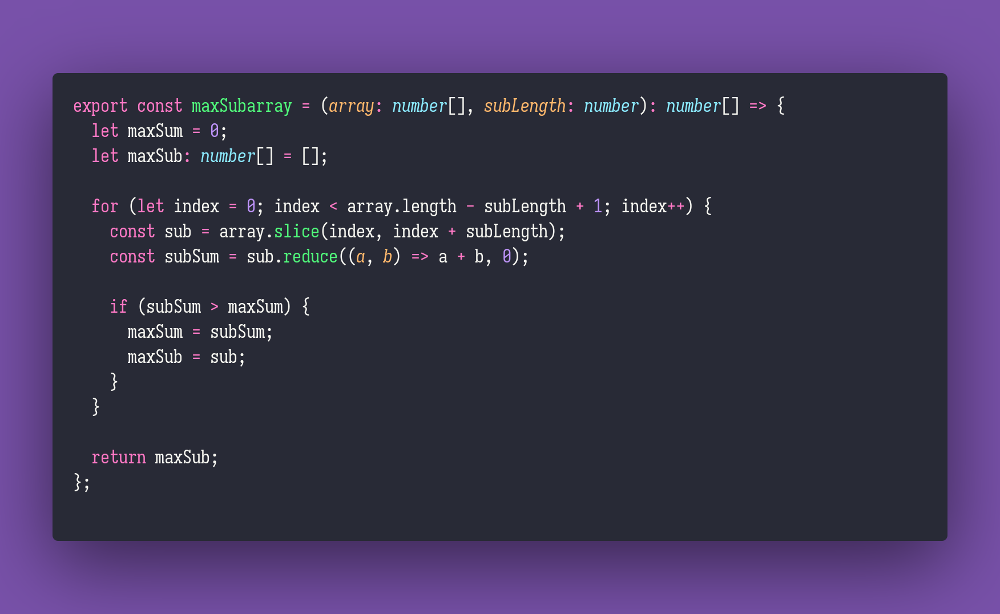

# max-subarray

Interview question of the [issue #281 of rendezvous with cassidoo](https://buttondown.email/cassidoo/archive/from-a-small-seed-a-mighty-trunk-may-grow/).

## The Question

Given an array of integers arr and an integer n, return a subarray of arr of length n where the
sum is the largest. Make sure you maintain the order of the original array, and if n is greater
than arr.length, you can choose what you want to return.

### Example

```js
> maxSubarray([-4,2,-5,1,2,3,6,-5,1], 4)
> [1,2,3,6]

> maxSubarray([1,2,0,5], 2)
> [0,5]
```

## Installing & Running

Just `pnpm install` to install all dependencies and then `pnpm test` to run the tests!

## Solution


