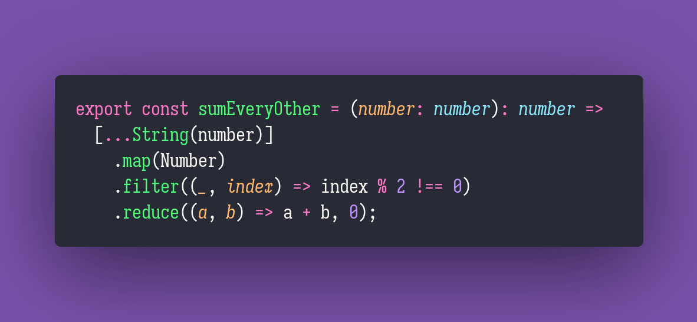

# Sum Every Other

Interview question of the [issue #282 of rendezvous with cassidoo](https://buttondown.email/cassidoo/archive/what-you-do-every-day-matters-more-than-what-you/).

## The Question

Given a number, sum every second digit in that number.

### Example

```js
> sumEveryOther(548915381)
> 26 // 4+9+5+8

> sumEveryOther(10)
> 0

> sumEveryOther(1010.11)
> 1 // 0+0+1
```

## Installing & Running

Just `pnpm install` to install all dependencies and then `pnpm test` to run the tests!

## Solution


