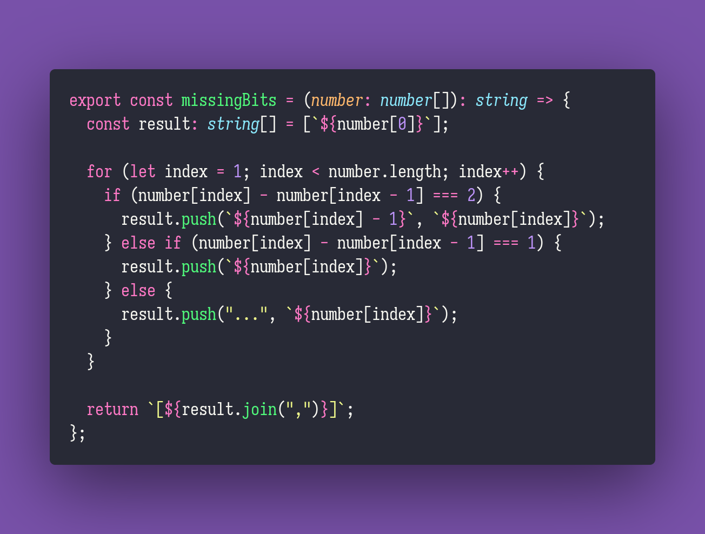

# Missing Bits

Interview question of the [issue #284 of rendezvous with cassidoo](https://buttondown.email/cassidoo/archive/the-best-prophet-of-the-future-is-the-past-lord/).

## The Question

You are given a list of positive integers which represents some range of integers which has been
truncated. Find the missing bits, insert ellipses to show that that part has been truncated, and
print it. If the consecutive values differ by exactly two, then insert the missing value.

### Example

```js
> missingBits([1,2,3,4,20,21,22,23])
> "[1,2,3,4,...,20,21,22,23]"

> missingBits([1,2,3,5,6])
> "[1,2,3,4,5,6]"

> missingBits([1,3,20,27])
> "[1,2,3,...,20,...,27]"
```

## Solution


