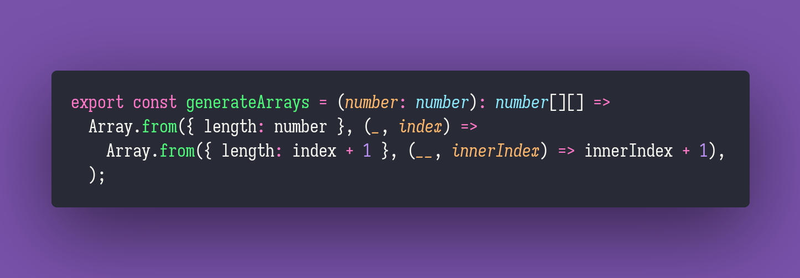

# Generate Arrays

Interview question of the [issue #285 of rendezvous with cassidoo](https://buttondown.email/cassidoo/archive/if-you-want-to-feel-good-you-have-to-go-out-and/).

## The Question

Given a positive integer, generate an array in which every element is an array that goes from 1
to the index of that array.

### Example

```js
> generateArrays(4)
> [[1], [1, 2], [1, 2, 3], [1, 2, 3, 4]]

> generateArrays(1)
> [[1]]
```

## Solution


