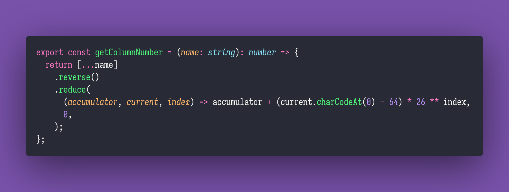

# Get Column Number

Interview question of the [issue #286 of rendezvous with cassidoo](https://buttondown.email/cassidoo/archive/talent-without-working-hard-is-nothing-cristiano/).

## The Question

Spreadsheet programs often use the [A1 Reference Style](https://learn.microsoft.com/en-us/office/troubleshoot/excel/numeric-columns-and-rows#the-a1-reference-style) to refer to columns.
Given a column name in this style, return its column number.

### Example

```js
> getColumnNumber("A")
> 1

> getColumnNumber("AB")
> 28

> getColumnNumber("AAA")
> 703
```

## Installing & Running

Just `pnpm install` to install all dependencies and then `pnpm test` to run the tests!

## Solution


