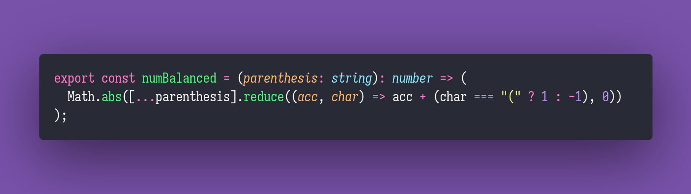

# Get Column Number

Interview question of the [issue #288 of rendezvous with cassidoo](https://buttondown.email/cassidoo/archive/to-think-that-everybodys-like-you-is-silly/).

## The Question

Given a string of parenthesis, return the number of parenthesis you need to add to the string in
order for it to be balanced.

### Example

```js
> numBalanced(`()`)
> 0

> numBalanced(`(()`)
> 1

> numBalanced(`))()))))()`)
> 6

> numBalanced(`)))))`)
> 5
```

## Installing & Running

Just `pnpm install` to install all dependencies and then `pnpm test` to run the tests!

## Solution


