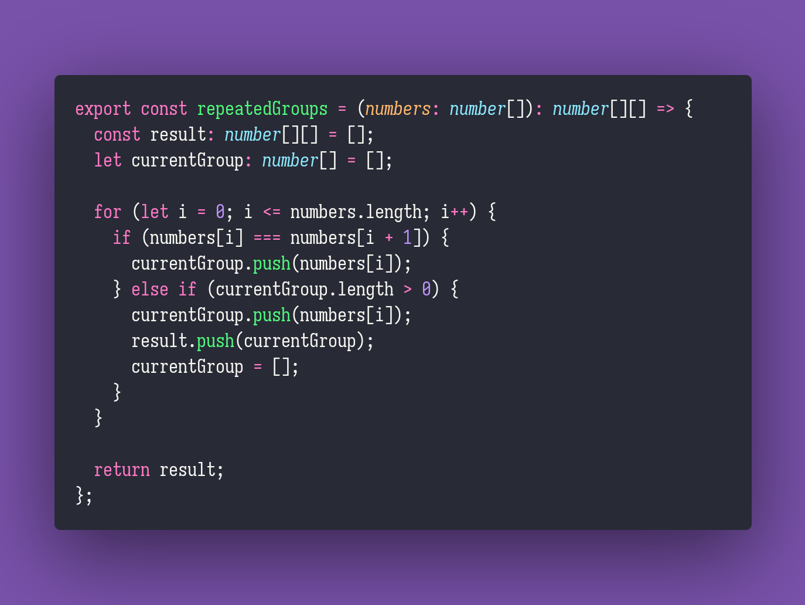

# Repeated Groups

Interview question of the [issue #289 of rendezvous with cassidoo](https://buttondown.email/cassidoo/archive/like-what-you-do-and-then-you-will-do-your-best/).

## The Question

Given a list of numbers, return all groups of repeating consecutive numbers.

### Example

```js
> repeatedGroups([1, 2, 2, 4, 5])
[[2, 2]]

> repeatedGroups([1, 1, 0, 0, 8, 4, 4, 4, 3, 2, 1, 9, 9])
[[1, 1], [0, 0], [4, 4, 4], [9, 9]]
```

## Installing & Running

Just `pnpm install` to install all dependencies and then `pnpm test` to run the tests!

## Solution


