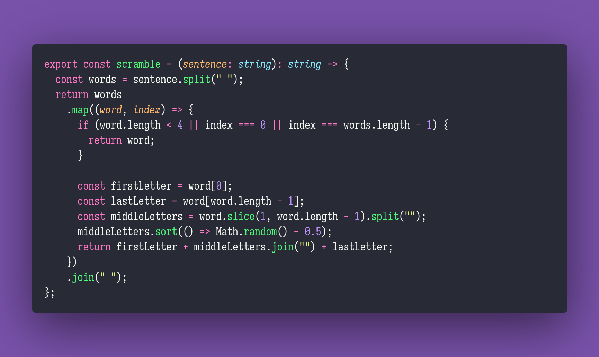

# Shuffle

Interview question of the [issue #290 of rendezvous with cassidoo](https://buttondown.email/cassidoo/archive/you-should-celebrate-who-you-are-eva-mendes/).

## The Question

If you mix up the order of letters in a word, many people can slitl raed and urenadnstd tehm.
Write a function that takes an input sentence, and mixes up the insides of words
(anything longer than 3 letters).

### Example

```js
> scramble("A quick brown fox jumped over the lazy dog.")
> "A qciuk bwron fox jmepud oevr the lzay dog."
```

## Installing & Running

Just `pnpm install` to install all dependencies and then `pnpm test` to run the tests!

## Solution


