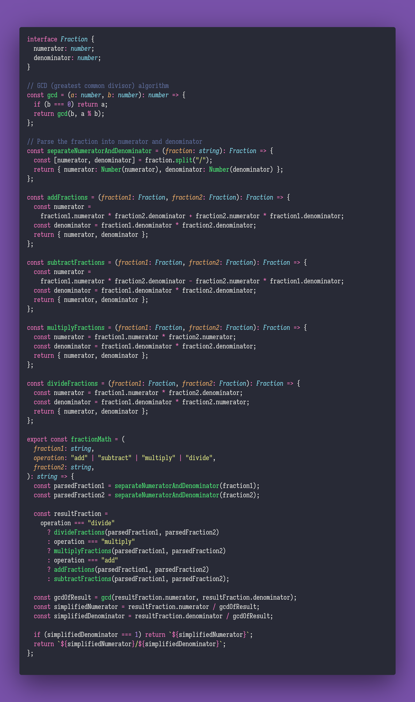

# Fraction Math

Interview question of the [issue #291 of rendezvous with cassidoo](https://buttondown.email/cassidoo/archive/5778/).

## The Question

Write a function that can do the 4 basic operations (add, subtract, multiply and divide) on two fractions. Return
the most simplified form of the result. You can assume a non-zero denominator in the input, and don’t use any
built-in implementations in your language of choice, if you can!

### Example

```js
> fractionMath("3/4", "add", "3/4")
> "3/2"

> fractionMath("1/8", "multiply", "2/2")
> "1/8"
```

## Installing & Running

Just `pnpm install` to install all dependencies and then `pnpm test` to run the tests!

## Solution


