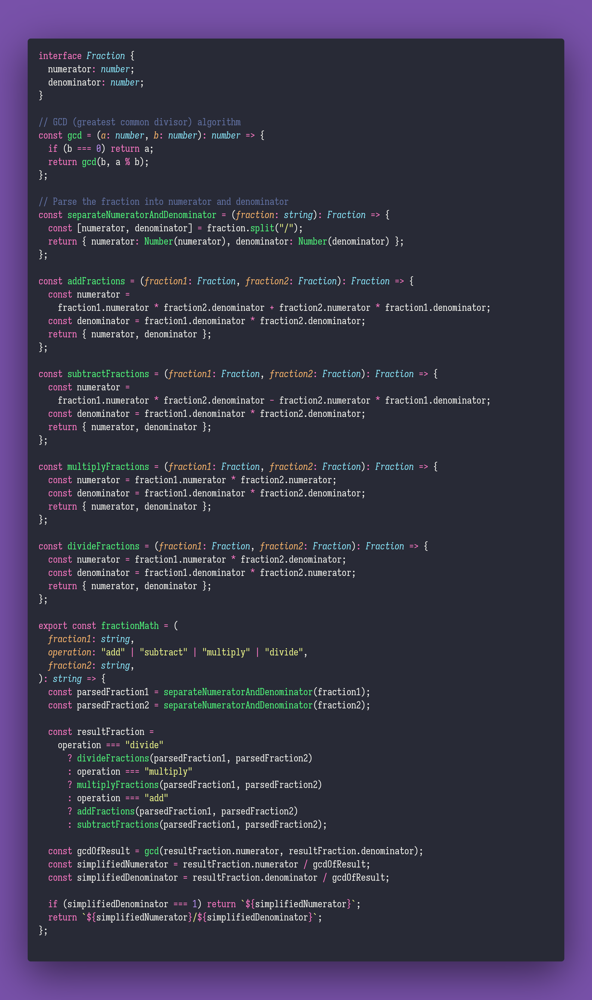

# Convert Color

Interview question of the [issue #292 of rendezvous with cassidoo](https://buttondown.email/cassidoo/archive/8279/).

## The Question

When you’re representing colors in a program, you typically use HEX, RGB, or HSL.
Write a program that converts between the different formats.

### Example

```js
> convertColor('rgb', 'hex', '(255,0,0)')
> '#FF0000'

> convertColor('hsl', 'rgb', '(65,80,80)')
> '(238,245,163)'

> convertColor('hsl', 'hex', '(65,80,80)')
> '#EEF5A3'
```

## Installing & Running

Just `pnpm install` to install all dependencies and then `pnpm test` to run the tests!

## Solution


