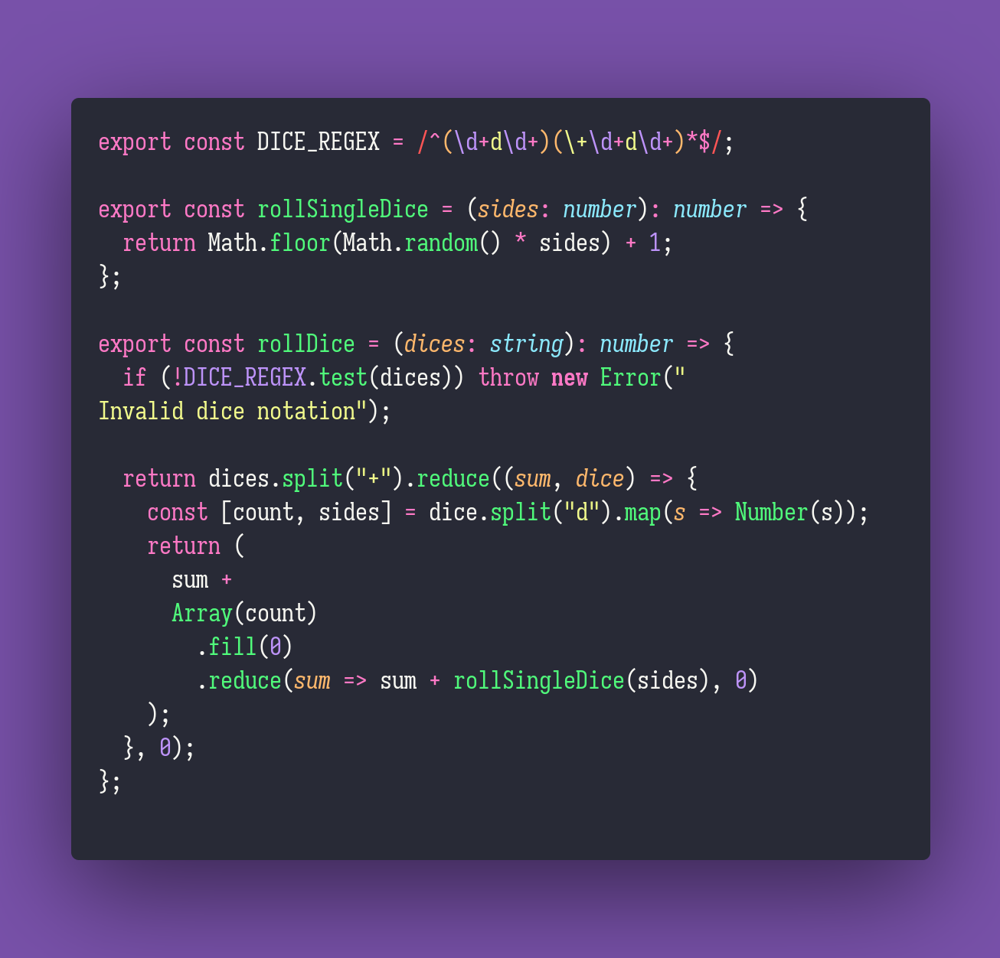

# Fraction Math

Interview question of the [issue #293 of rendezvous with cassidoo](https://buttondown.email/cassidoo/archive/3709/).

## The Question

Given a string in dice notation, return a random integer you can get by rolling those dice.

### Example

```js
> rollDice('4d4') // Four 4-sided dice
> 13

> rollDice('3d20') // Three 20-sided dice
> 28

> rollDice('1d8+2d10') // One 8-sided dice, and two 10-sided dice
> 21
```

## Solution


