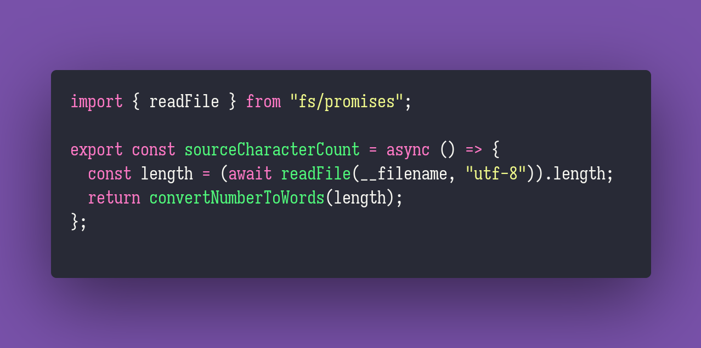

# Source Character Count

Interview question of the [issue #294 of rendezvous with cassidoo](https://buttondown.email/cassidoo/archive/6/).

## The Question

Write a program that prints the amount of characters its source has in English words.
So a program that is 44 characters long would output “forty four” and a program that is 108
characters long would output “one hundred eight”.

## Solution

