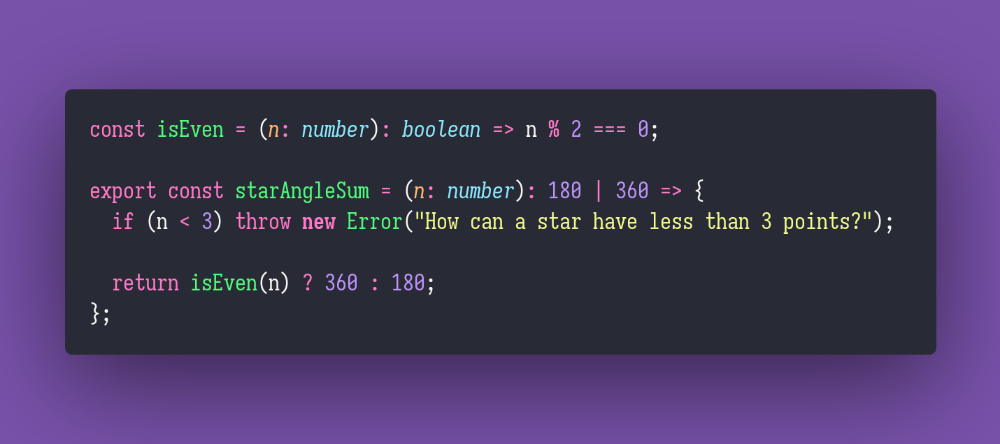

# Star Angle Sum

Interview question of the [issue #295 of rendezvous with cassidoo](https://buttondown.email/cassidoo/archive/5341/).

## The Question

Write a function where given integer n, it returns the angles at each point of a star with n
points.
Hint: The sum of the angles at each point of a 5 pointed star is 180 degrees, and at a 6 pointed
is 360 degrees.

### Example

```js
> starAngleSum(5)
180
> starAngleSum(6)
360
```

## Solution


