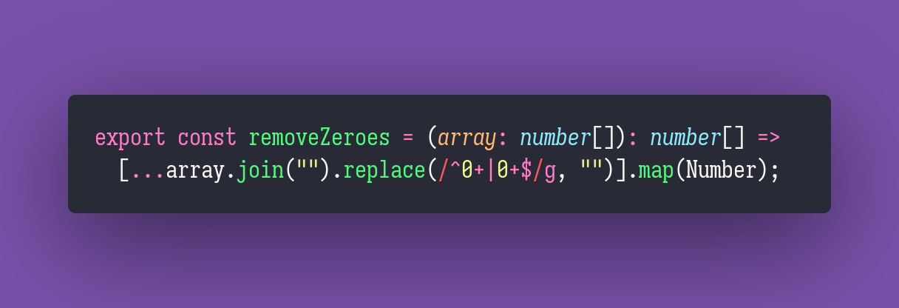

# Remove Zeroes

Interview question of the [issue #298 of rendezvous with cassidoo](https://buttondown.email/cassidoo/archive/5528/).

## The Question

Given a non-empty array containing only non-negative integers, return the list with trailing and
leading zeroes removed.

### Example

```js
> removeZeroes([0, 0, 0, 3, 1, 4, 1, 5, 9, 0, 0, 0, 0])
> [3, 1, 4, 1, 5, 9]

> removeZeroes([0, 0, 0])
> []

> removeZeroes([8])
> [8]
```

## Solution


