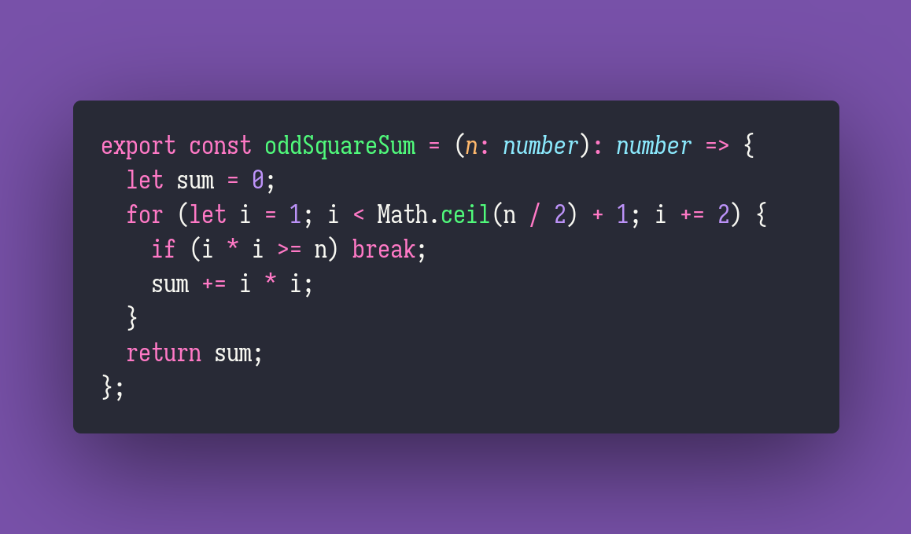

# Odd Square Sum

Interview question of the [issue #299 of rendezvous with cassidoo](https://buttondown.email/cassidoo/archive/6053/).

## The Question

Sum the [odd-square numbers](https://oeis.org/A016754) less than a given integer n.

### Example

```js
> oddSquareSum(1)
> 0

> oddSquareSum(2)
> 1

> oddSquareSum(9)
> 1

> oddSquareSum(10)
> 10

> oddSquareSum(44)
> 35
```

## Solution


