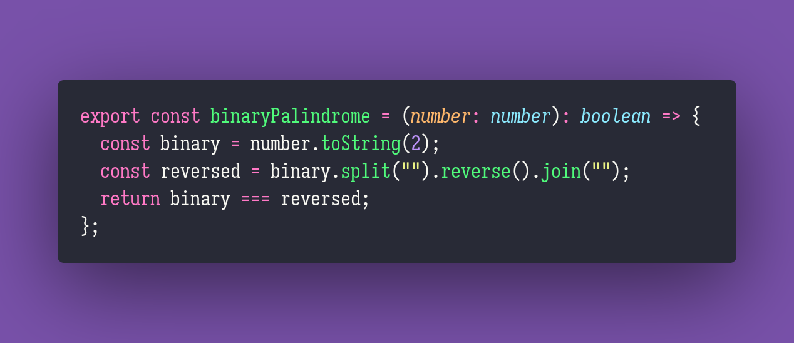

# Binary Palindrome

Interview question of the [issue #300 of rendezvous with cassidoo](https://buttondown.email/cassidoo/archive/1545/).

## The Question

Write a function to find out whether the binary representation of a number is palindrome or not.

### Example

```js
> binaryPal(5)
> true

> binaryPal(10)
> false
```

## Solution


