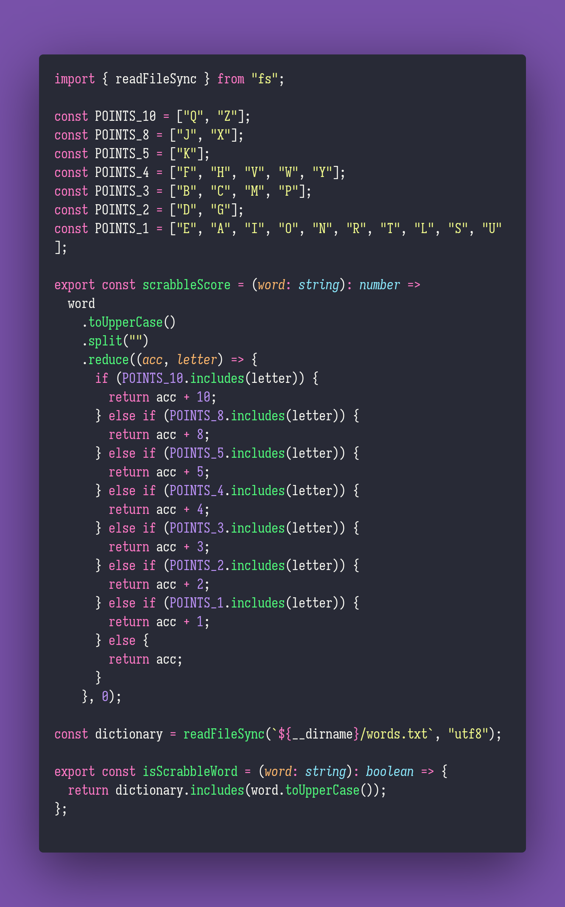

# Remove Zeroes

Interview question of the [issue #301 of rendezvous with cassidoo](https://buttondown.email/cassidoo/archive/if-you-really-want-something-you-can-figure-out/).

## The Question

Given a string, calculate the score that it would get in a game of Scrabble. For extra credit, try
verifying if the string is a valid word, or take into account premium squares!

### Scoring

- 1 point: E, A, I, O, N, R, T, L, S, U
- 2 points: D, G
- 3 points: B, C, M, P
- 4 points: F, H, V, W, Y
- 5 points: K
- 8 points: J, X
- 10 points: Q, Z

### Example

```js
> scrabbleScore('FIZZBUZZ')
> 49
```

## Solution


