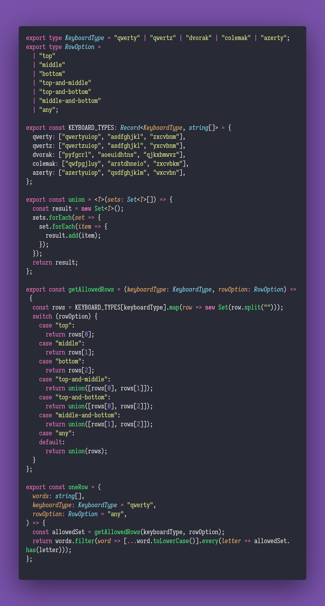

# Remove Zeroes

Interview question of the [issue #302 of rendezvous with cassidoo](https://buttondown.email/cassidoo/archive/1868/).

## The Question

Given an array of words, return the words that can be typed using letters of only one row on a
keyboard. For bonus points, include the option for a user to pick the type of keyboard they are
using (ANSI, ISO, etc), and/or give options for how many/which rows are allowed!

### Example

```js
> oneRow(['candy', 'fart', 'pop', 'Zelda', 'flag', 'typewriter'])
> ['pop', 'flag', 'typewriter']
```

## Solution


