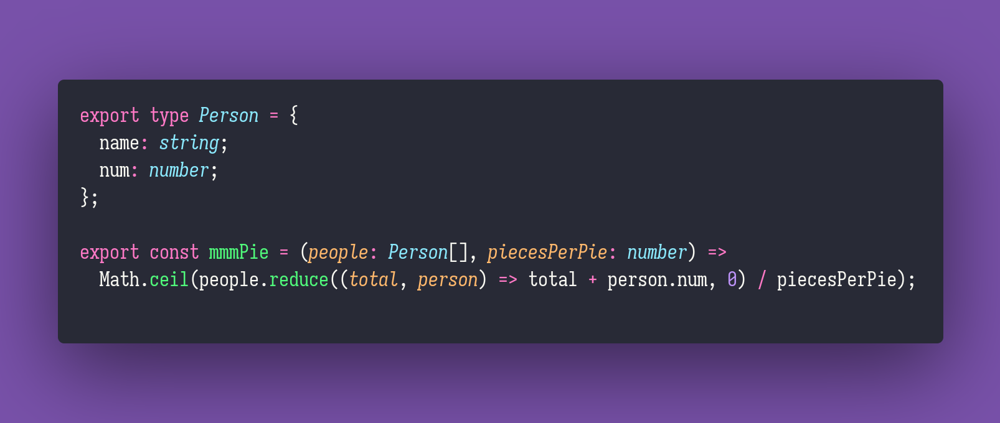

# MMM Pie

Interview question of the [issue #303 of rendezvous with cassidoo](https://buttondown.email/cassidoo/archive/8309/).

## The Question

Given an array of people objects (where each person has a name and a number of pie pieces they’re
hungry for) and a number for the number of pieces that the pie can be cut into, return the number
of pies you need to buy.

### Example

```js
> arr = [{ name: Joe, num: 9 }, { name: Cami, num: 3 }, { name: Cassidy, num: 4 }]
> mmmPie(arr, 8)
> 2 // 16 pieces needed, pies can be cut into 8 pieces, so 2 pies should be bought
```

## Solution


