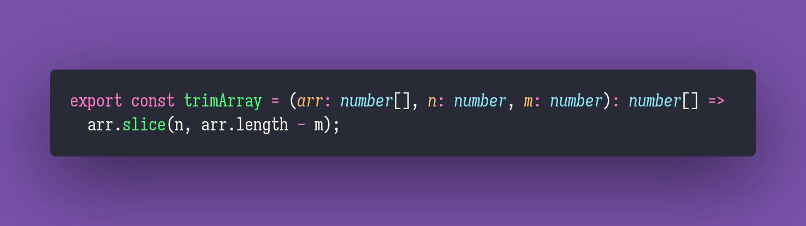

# Trim Array

Interview question of the [issue #304 of rendezvous with cassidoo](https://buttondown.email/cassidoo/archive/5922/).

## The Question

Given an array arr and integers n and m, remove n elements from the front of the array, and m
elements from the back. Assume that n + m <= arr.length.

### Example

```js
> trimArray([1, 2, 3, 4, 5, 6], 2, 1)
> [3, 4, 5]

> trimArray([6, 2, 4, 3, 7, 1, 3], 5, 0)
> [1, 3]

> trimArray([1, 7], 0, 0)
> [1, 7]
```

## Solution


