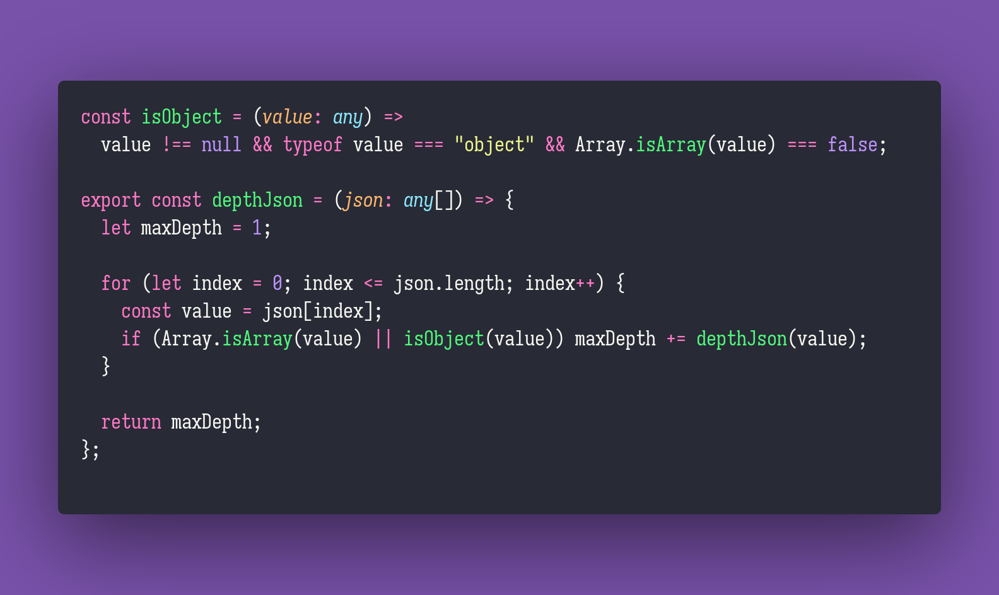

# Depth JSON

Interview question of the [issue #305 of rendezvous with cassidoo](https://buttondown.email/cassidoo/archive/5640/).

## The Question

Given some JSON data, calculate the maximum depth reached.
Both arrays and dictionaries increase the depth!
If the input is invalid data, the response should be undefined.

### Example

```js
> depthJson([])
> 1

> depthJson([1, 2, 3, 4, 5])
> 1

> depthJson([{"a": []}, ["abc"]])
> 3
```

## Solution


