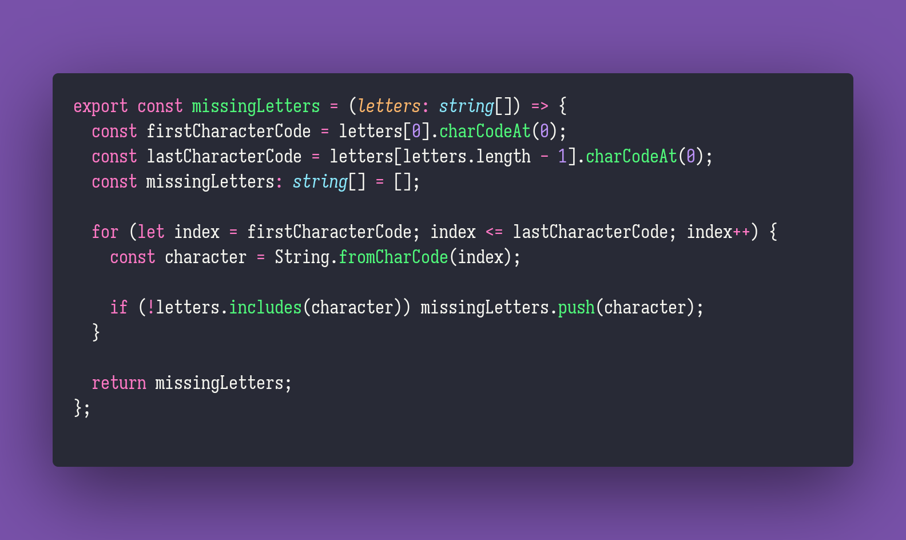

# Missing Letters

Interview question of the [issue #306 of rendezvous with cassidoo](https://buttondown.email/cassidoo/archive/change-is-a-stranger-you-have-yet-to-know-george/).

## The Question

Write a function that takes an array of consecutive, increasing letters as input, and returns any
missing letters in the array between the first and last letter.

### Example

```js
> missingLetters(['a','b','c','d','f'])
> ['e']

> missingLetters(['a','b','c','d','e','h','i','j','k','l','m','n','o','p','q','r','s','t','u','w','x','y','z'])
> ['f','g','v']
```

## Solution


