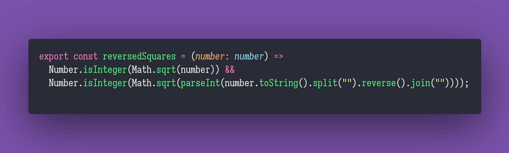

# Reversed Squares

Interview question of the [issue #307 of rendezvous with cassidoo](https://buttondown.email/cassidoo/archive/2447/).

## The Question

Given an integer n, return true if it's a perfect square AND when reversed, is still a perfect
square.

### Example

```js
> reversedSquares(9)
> true

> reversedSquares(441)
> true

> reversedSquares(25)
> false
```

## Solution


