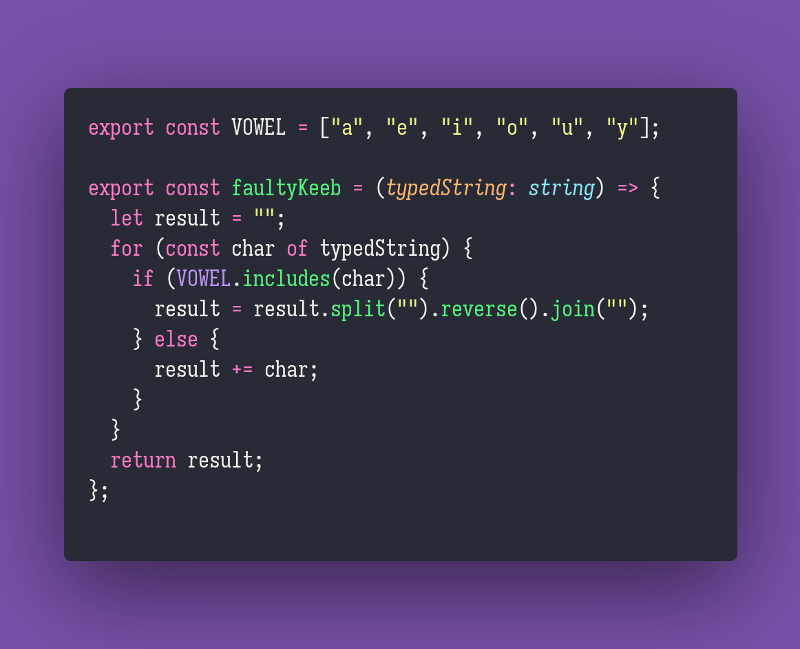

# Faulty Keyboard

Interview question of the [issue #313 of rendezvous with cassidoo](https://buttondown.email/cassidoo/archive/the-road-to-success-is-always-under-construction/).

## The Question

You have a faulty keyboard. Whenever you type a vowel on it (a,e,i,o,u,y), it reverses the string
that you have written, instead of typing the character. Typing other characters works as expected.
Given a string, return what will be on the screen after typing with your faulty keyboard.

### Example

```js
> faultyKeeb('string')
> 'rtsng'

> faultyKeeb('hello world!')
> 'w hllrld!'
```

## Solution


