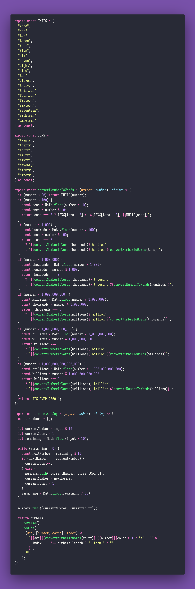

# Count and Say

Interview question of the [issue #315 of rendezvous with cassidoo](https://buttondown.email/cassidoo/archive/a-ship-in-port-is-safe-but-thats-not-what-ships/).

## The Question

Given a sequence of numbers, generate a "count and say" string.

### Example

```js
> countAndSay(112222555)
> "two 1s, then four 2s, then three 5s"

> countAndSay(3333333333)
> "ten 3s"
```

## Solution


