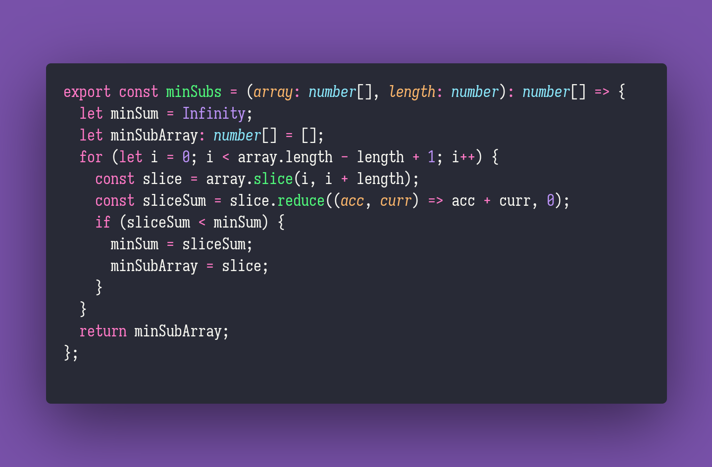

# Min Subs

Interview question of the [issue #316 of rendezvous with cassidoo](https://buttondown.email/cassidoo/archive/your-self-worth-is-determined-by-you-beyonce/).

## The Question

**Given an array of integers and a number k (where k is guaranteed to be less than the array's
length), return a subarray of length k with the minimum possible sum.**
Maintain the order of the original array!

### Example

```js
> minSubs([1,3,20,4,8,9,11], 3)
> [4,8,9]

> minSubs([4,4,4,4,8], 2)
> [4,4]
```

## Solution


