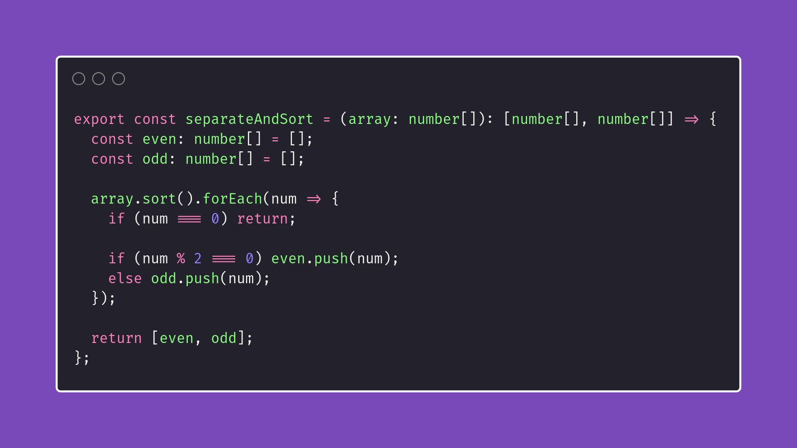

# Min Subs

Interview question of the [issue #317 of rendezvous with cassidoo](https://buttondown.email/cassidoo/archive/people-who-think-they-know-everything-are-a-great/).

## The Question

Given an array of integers, sort them into two separate sorted arrays of even and odd numbers.
If you see a zero, skip it.

### Example

```js
> separateAndSort([4,3,2,1,5,7,8,9])
> [[2,4,6], [1,3,5,7,9]]

> separateAndSort([1,1,1,1])
> [[], [1,1,1,1]]
```

## Solution


