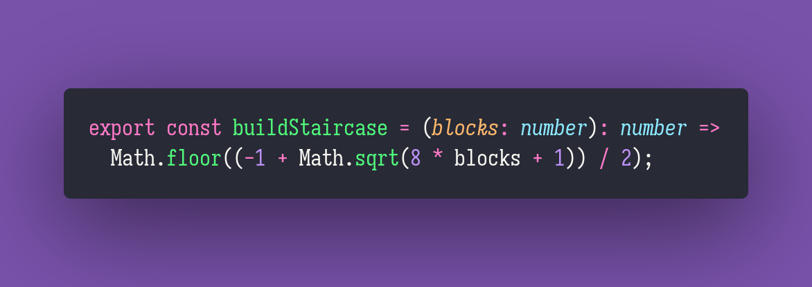

# 🦜 Build Staircase

Interview question of the [issue #318 of rendezvous with cassidoo](https://buttondown.email/cassidoo/archive/let-us-remember-that-our-voice-is-a-precious-gift/).

## The Question

You have n equal-sized blocks and you want to build a staircase with them.
Return the number of steps you can fully build.

### Example

```js
> buildStaircase(6)
> 3

// #
// ##
// ###

> buildStaircase(9)
> 3 // it takes 10 blocks to make 4 steps
```

## My Notes

It took me an embarrassingly long time to figure out why the sequence of numbers were so familiar.
In the end I realized that it was the [triangular numbers](https://en.wikipedia.org/wiki/Triangular_number).
From there the solution is trivial, since you just need to return the closest triangular number
without going over the number of blocks.

## Solution


