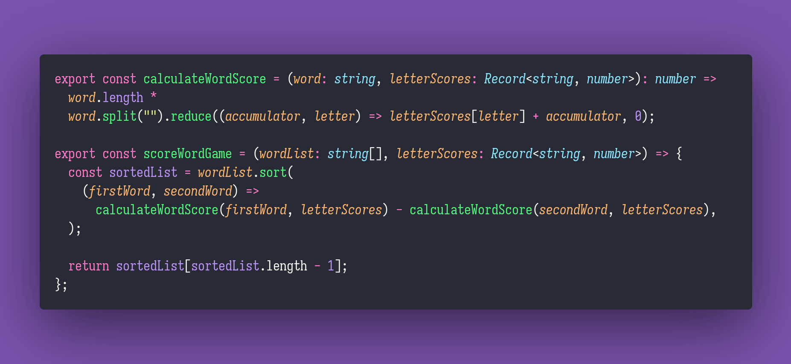

# 🎮 Score Word Game

Interview question of the [issue #325 of rendezvous with cassidoo](https://buttondown.email/cassidoo/archive/quality-is-not-an-act-it-is-a-habit-aristotle/).

## The Question

**Given a list of words and a dictionary of letter scores, find the word with the highest score
according to the rules:**

`score = word_length * (sum of letter scores in the word)`

If there are multiple words with the same highest score, return the lexicographically smallest one.

### Example

```js
const wordList = ["apple", "banana", "cherry", "date", "fig"];

const letterScores = [...Array(26).keys()].reduce((scores, i) => (scores[String.fromCharCode(97 + i)] = i + 1, scores), {});
// This produces { 'a': 1, 'b': 2, 'c': 3, 'd': 4, ... }

scoreWordGame(wordList, letterScores)
// 'cherry'
```

## Solution


