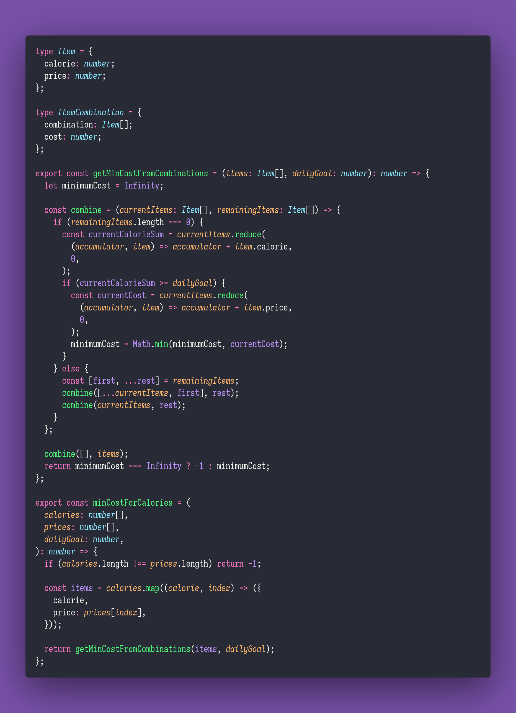

# 🍠 Min Cost for Calories

Interview question of the [issue #328 of rendezvous with cassidoo](https://buttondown.email/cassidoo/archive/when-i-let-go-of-what-i-am-i-become-what-i-might/).

## The Question

Given two arrays calories and prices, where calories\[i\] and prices\[i\] represent the calorie
content and price of the ith food item, and a daily calorie goal, find the minimum cost to achieve
or exceed the daily calorie goal. If it's impossible to meet the goal, return -1.

### Example

```js
let calories = [200, 400, 600, 800]
let prices = [50, 60, 80, 100]
let dailyGoal = 1200

> minCostForCalories(calories, prices, dailyGoal)
> 160 // the 2nd and 4th items add up to 1200 calories for the minimum cost
```

## Solution



## Remarks

I started out by attempting to solve this problem with a greedy algorithm using calories per price
ratio. This worked for the example, but I quickly realized that it would not work for all cases.
For example, if the calorie goal was 1000, the greedy algorithm would choose the 3rd item, which
would be the most expensive option.

I then realized that this problem is a variation of the
[Knapsack problem](https://en.wikipedia.org/wiki/Knapsack_problem).

My solution goes through all possible combinations of items, on each combination that meets the
calorie goal, it calculates the cost, if the cost is lower than the current minimum cost, it
updates the minimum cost. Once all combinations have been checked, it returns the minimum cost.

I'm not sure if this is the most efficient solution, but it works.
