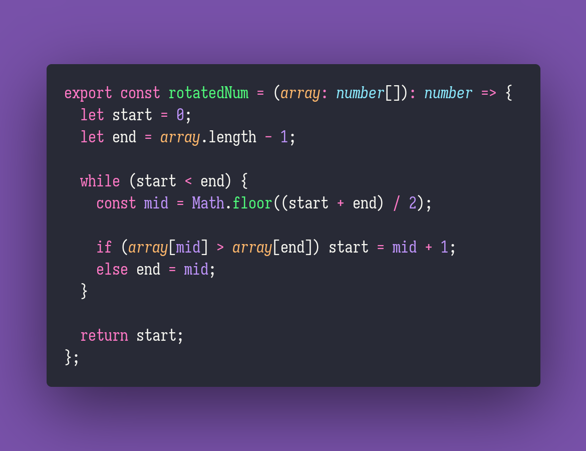

# 🗞️ Rotated Num

Interview question of the [issue #329 of rendezvous with cassidoo](https://buttondown.email/cassidoo/archive/the-best-preparation-for-tomorrow-is-doing-your-9764/).

## The Question

There is a sorted integer array that has been rotated an unknown number of times.
Given that rotated array, return how many times it has been rotated.
It may contain duplicate numbers!

### Example

```js
> rotatedNum([4, 0, 1, 2, 3])
> 1

> rotatedNum([7, 9, 20])
> 0

> rotatedNum([7, 7, 314, 1337, 7])
> 4
```

## Solution


