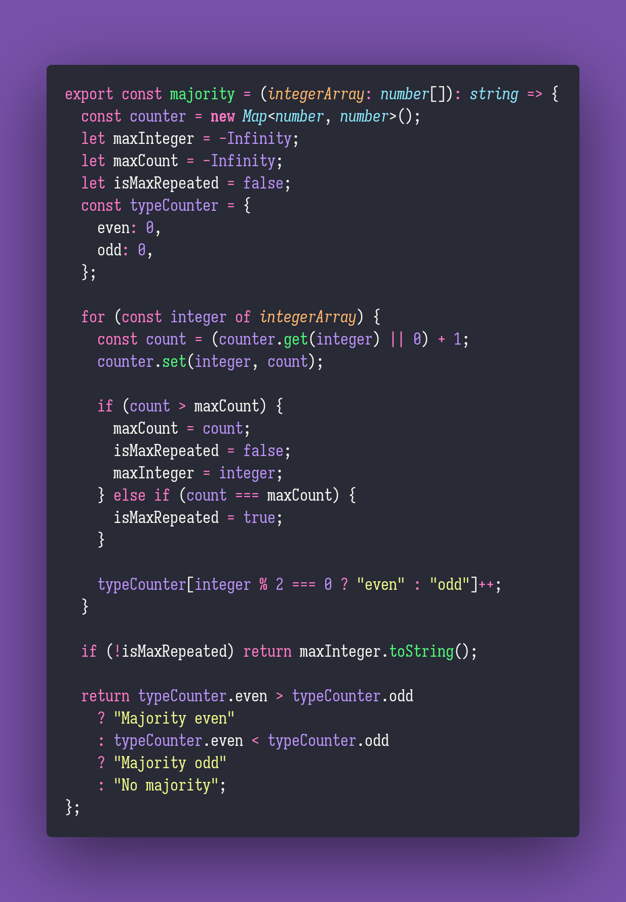

# 🚇 Majority

Interview question of the [issue #330 of rendezvous with cassidoo](https://buttondown.email/cassidoo/archive/look-for-the-ridiculous-in-everything-and-you/).

## The Question

**Given an array of integers, return the majority element.**
If there is no majority element, return if the array is majority even or odd numbers,
and if there is none, say so.

### Example

```js
> majority([3,1,4,1])
> "1"

> majority([33,44,55,66,77])
> "Majority odds"

> majority([1,2,3,4])
> "No majority"
```

## Solution


