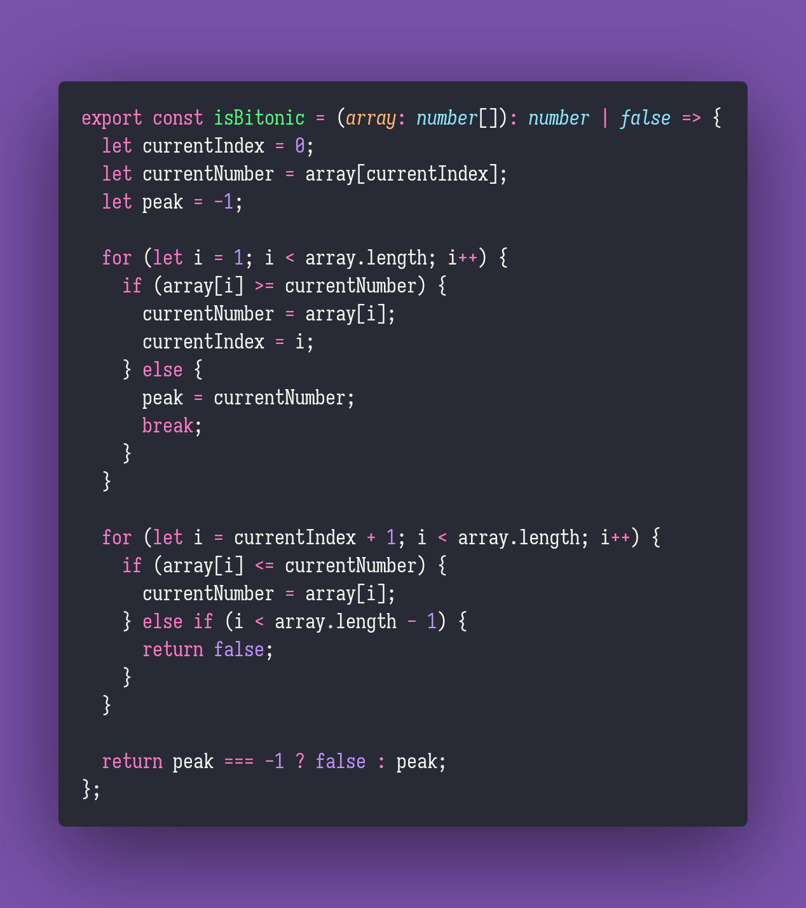

# 🚏 Is Bitonic

Interview question of the [issue #331 of rendezvous with cassidoo](https://buttondown.email/cassidoo/archive/everything-has-beauty-but-not-everyone-sees-it/).

## The Question

**Write a function that determines if an array of numbers is a bitonic sequence.**
A bitonic sequence is a sequence of numbers in which the numbers are in increasing order, and
after a certain point, they start decreasing. Extra credit: print the peak number in the sequence!

### Example

```js
> isBitonic([1,2,3,2])
> true // extra credit: 3

> isBitonic([1,2,3])
> false

> isBitonic([3,4,5,5,5,2,1])
> true // extra credit: 5
```

## Solution


