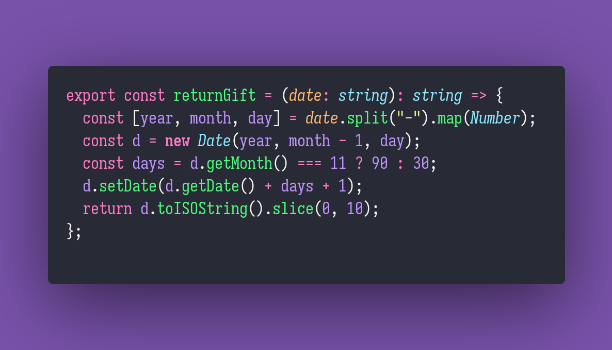

# 🎁 Return Gift

Interview question of the [issue #332 of rendezvous with cassidoo](https://buttondown.email/cassidoo/archive/in-seed-time-learn-in-harvest-teach-in-winter/).

## The Question

**You have some gifts you want to return. Gifts bought in December have a 90-day return window, and all other gifts have a 30-day return window. Given a gift's buy date, write a function that prints the last day you can return the gift.**

The date format should be ISO 8601, and the function should accept a date string and return a
date string.

### Example

```js
> returnGift("2023-12-25")
> "2024-03-24"
```

## Solution


