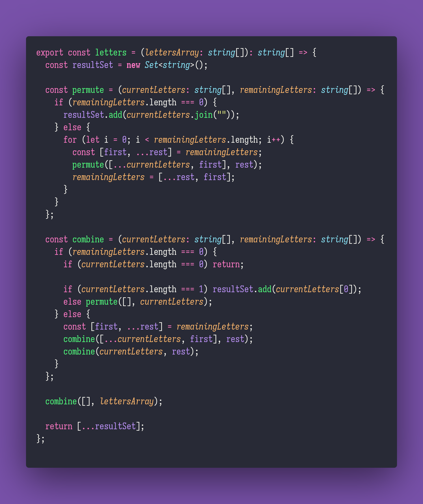

# 🧼 Letters

Interview question of the [issue #334 of rendezvous with cassidoo](https://buttondown.email/cassidoo/archive/the-most-effective-way-to-do-it-is-to-do-it-5924/).

## The Question

You have an array of letters. Return the number of possible sequences of letters you can make
using the letters in the array.

**Extra Credit: print the sequences.**

### Example

```js
> letters(['X'])
> 1

> letters(['A', 'A', 'B'])
> 8 // "A", "B", "AA", "AB", "BA", "AAB", "ABA", "BAA"
```

## Solution


