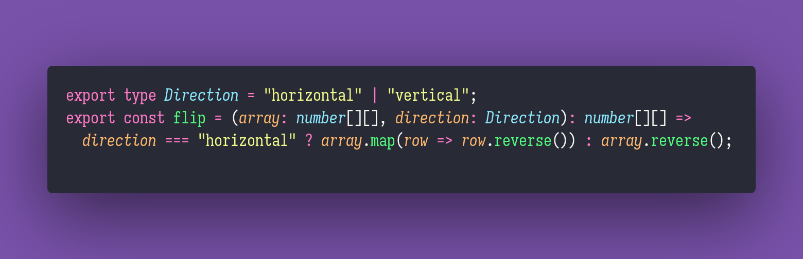

# 🤸 Flip

Interview question of the [issue #335 of rendezvous with cassidoo](https://buttondown.email/cassidoo/archive/the-most-effective-way-to-do-it-is-to-do-it-5924/).

## The Question

Given a 2D array, write a function that flips it vertically or horizontally.

### Example

```js
let array = [
[1,2,3],
[4,5,6],
[7,8,9]
]

> flip(array, 'horizontal')
> [[3,2,1],[6,5,4],[9,8,7]]

> flip(array, 'vertical')
> [[7,8,9],[4,5,6],[1,2,3]]
```

## Solution


