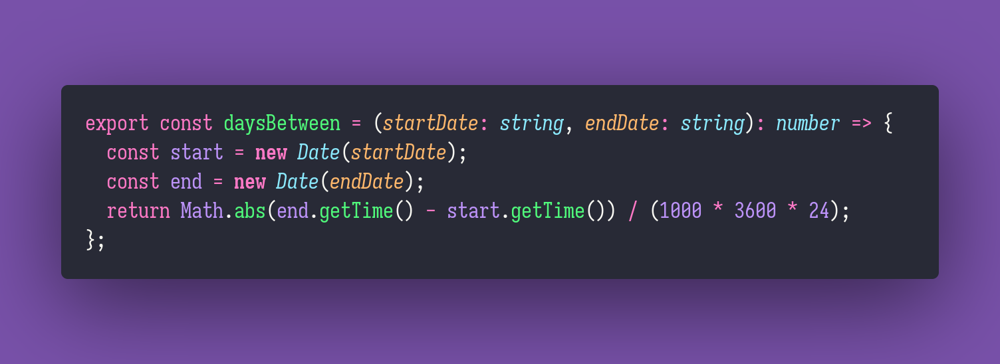

# 🐹 Days Between

Interview question of the [issue #337 of rendezvous with cassidoo](https://buttondown.email/cassidoo/archive/maybe-your-weird-is-my-normal-whos-to-say-nicki/).

## The Question

Write a function called daysBetween that takes in two dates, and returns the number of days
between those dates. You can choose the date format you'd like to accept!

### Example

```js
> daysBetween('Jan 1, 2024', 'Jan 29, 2024')
> 28

> daysBetween('Feb 29, 2020', 'Oct 31, 2023')
> 1340
```

## Solution


