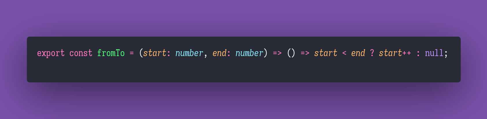

# From To

Interview question of the [issue #339 of rendezvous with cassidoo](https://buttondown.email/cassidoo/archive/youve-got-to-love-whats-yours-alicia-keys/).

## The Question

Write a function that produces a generator that produces values in a range.

### Example

```js
let range = fromTo(0,3)

> range()
0
> range()
1
> range()
2
> range()
null
```

## Solution


